<style>
img {
  border: 1px solid black;
}
</style>
# Глобальные шорткаты
`F12` - toggle dev tools  

`Ctrl+Shift+P` - open command menu  

`F1` в devtools - open settings  

`Ctrl+E` - start/stop recording (if available in current tab)  
Заменяет клик по этой кнопке  
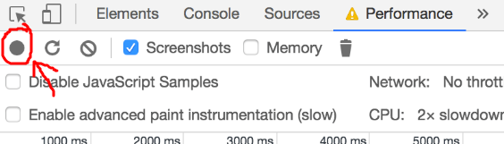  

``Ctrl+` `` - focus console (open if closed)  

Все-все-все шорткаты:
[https://developers.google.com/web/tools/chrome-devtools/shortcuts](https://developers.google.com/web/tools/chrome-devtools/shortcuts)  

# Elements
В DOM можно двигаться по элементам клавишами стрелок, редактировать по `Enter`/`Tab`  

`F2` - edit as HTML  

console: `document.body.contentEditable = true` - и можно редактировать любой текст
на странице. Полезнь смотреть что будет если в верстке окажется слишком большой текст

`Alt+Click`/`Alt+Left/Right` - collapse/expand рекурсивно по всем детям:  
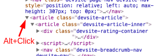  
HINT: `Alt+Click` работает рекурсивно по всем девтулам: console, таблички в performance...

## Styles 
`Ctrl+Click` по свойству стиля = go to definition for styles  

**:hov** - force state of element (hover, active etc.)  
**:cls** - add/remove classnames  
По любому цветному квадратику  (цвет, animation, box-shadow) можно кликнуть - будет гуй с выбором цвета.  
`Shift-Click` - изменит формат цвета (RGB/HEX/…)  
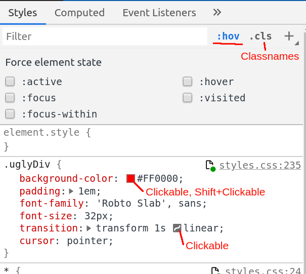  

`Up`/`Down` на числовых свойствах - +1/-1.  
`Shift+Up/Down` +10/-10  
`Ctrl+Up/Down` +100/-100  
`Alt+Up/Down` +0.1/-0.1  

Внизу computed style - будет _отрендеренный_ шрифт:  
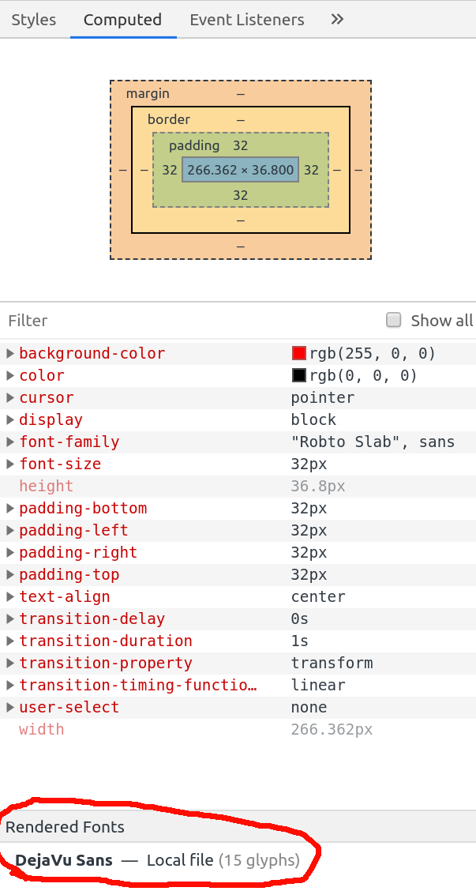  

Settings - Elements - check 'Show user agent shadow DOM' - inspect complex elements like ‘input’  

## Animations
`Ctrl+Shift+P` - `Show animations` - выполнить какую-либо анимацию  
Отладка анимаций: просмотр на 25%/10% скорости, покадрово.  
Если двигать ползунки со временеи - то это сразу прилетит в style свойство.  
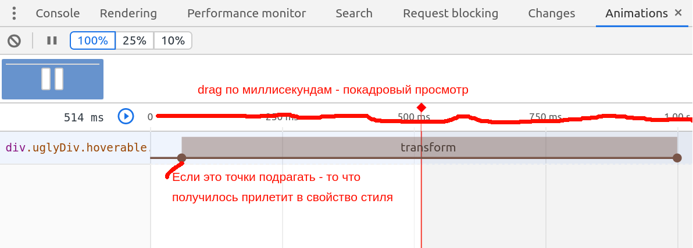  

# Console
В консоли можнго использовать $ вместо querySelector (и это не jQuery))  

`$0` в консоли - это выделенный элемент в _Elements_  
`$1` - это тот элемент который был выделен до этого  
`$2, ...` - другие элементы которые были выделены  

`$_` в консоли - результат последней операции  

`Alt+Click` по expand - будет глубокий экспанд  

Консольному тексту можно давать текстовые стили console.log('%c11111', 'background:#00FF00')  

Для трейса в логе можно использовать `console.trace/warn/error`  

`console.dir($0)` - вывести DOM-элемент как js-объект  
`console.count('label')` - лог со счетчиком   
`console.groupCollapsed/group/groupEnd` - группировка (вывести группу логов, которую можно expand/collapse)  
`console.table(array)` для массивов  
`console.clear()` — очистка всех записей в консоли.  

Чисто хромовские штуки:
`copy(somevar)` — копирование в буфер обмена строкового представления указанного объекта.  
`inspect(something)` — открывает и выбирает указанный элемент или объект в соответствующей панели: Elements или Profiles.  
Settings -> Console -> Show timestamps для показа timestamps

**Performance** ни в коем случае не замерять `Date.now()`!!11
Для этого есть всторенный объект [performance](https://developer.mozilla.org/ru/docs/Web/API/Performance)

Warning! если мы логаем не-примитивную переменную - то по клику на expand в экспанженном виде мы увидим то значение, которое актуально _на момент клика_. 
```
const ob = { a: [0, 1], b: 2, c: '3string' }
console.clear()
console.log('start')
console.log(ob)
setTimeout(() =` {
  ob.a.push(2);
  ob.b = 100500;
  ob.c = 'anotherstring';
  console.log('timeout')
}, 2001);
// Попробовать кликнуть до ‘timeout’ и после ‘timeout’
```

# Network
Аббривеатура `TTFB` = Time To First Byte = время от _запрос отправлен_ до _прилетел первый байт ответа_  

Кнопки JS/CSS/… - можно сразу несколько по Ctrl  
RMB в шапке таблицы с запросами - показ/скрытие колонок  
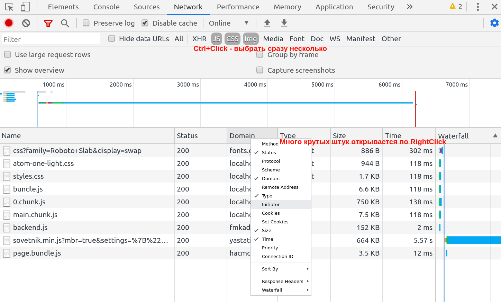  

Block requests - `Ctrl+Shift+P` => `show request blocking`  
Какие-то урлы можно блочить - `RightClick` по айтему в табличке - block request. Работают wildchars  
`RightClick` по блоку в списке - block (заблочить этот реквест), replay (повторить запрос)  
filter - если начать с “-” - будет отрицание, можно писать регулярки внутри “//”. Фильтр по домену - “domain:домен”, в нем регулярки не работают, только wildchars  

Цвета вертикальных линий в общем графике -   
Red: load fires when all subframes, images, stylesheets, scripts, etc have been downloaded  
Blue: DOMContentLoaded fires when the document is loaded and the DOM tree is fully constructed  

### Как выключить hot reload на стороне браузера
В Network показать WS-запросы.  
Убедиться, что мы нашли нужный: при изменении кода в hot-reload websocket прилетает что-то про `hot`  
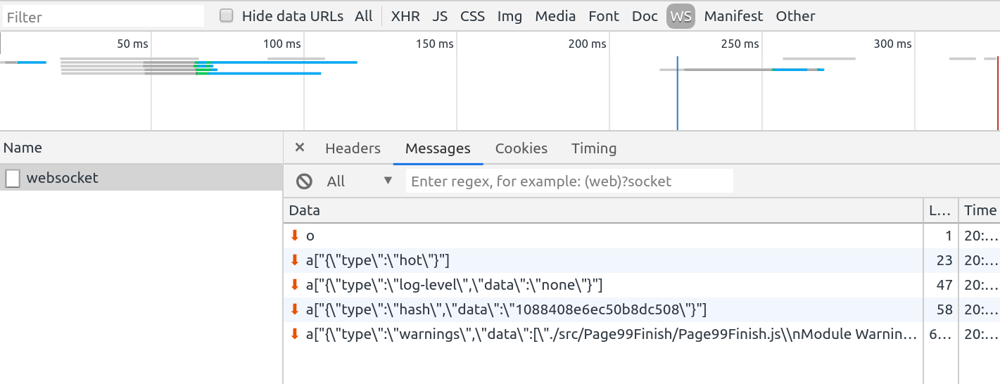  

Смотри адрес, откуда прилетает вебсокет
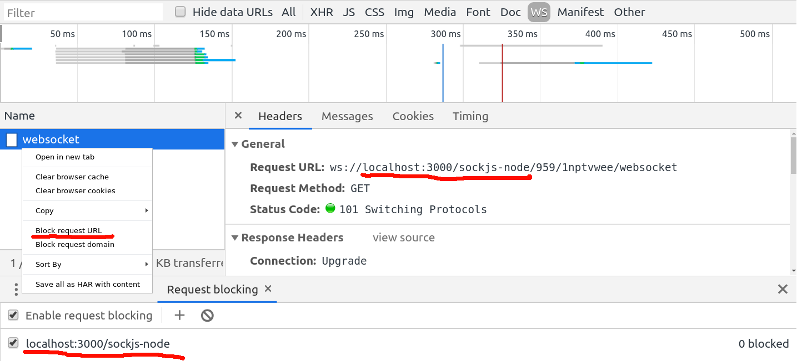  

`RightClick` - block request URL  
Подчищаем правую часть урла, т.к. она меняется на каждом запуске  
Должно остаться только `localhost:3000/sockjs-node` или вроде того

# Coverage
`Ctrl+Shift+P` => `Show coverage`  
Релоад страницы.  
Для каждого файла показано, сколько в нем unused bytes.  
Клик по файлу в списке coverage - откроет этот файл, слева будет подсвечено зеленый (used) / красный (unused)  
Если что-то на странице поделать, used/unused будут обновляться в реальном времени.  

# Sources
`Ctrl+G` - enter number for go to line  
`Ctrl+Shift+O` - go to function declaration in current file  
`Ctrl+F8` - enable/disable all breakpoints"  

`Ctrl+Alt+B` - add breakpoints/logpoints  
Что такое logpoints: - это все равно что в данной строке кода написать `console.log`.
Можно выводить переменные и пр.  

Во время остановки по breakpoint:  
`Ctrl+.` `Ctrl+,` - Select the call frame below / above the currently-selected frame  

Продолжить выполнение, игнорируя все оставшиеся брейкпоинты:  
Click and hold Resume Script Execution and then select Force script execution  
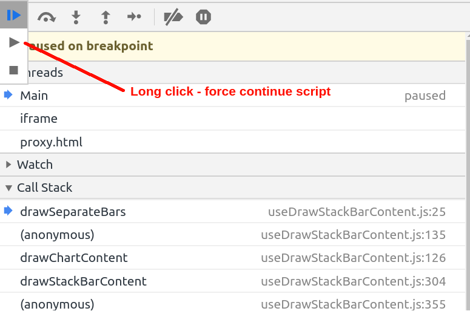  

Если что-то пропустили - то можно вернуться к нужному месту:   
на коллстеке: находим вызов, к которому хотим вернуться. `RightClick` -> `restart frame`  

Если в call stack много вендоров (типа react) - их можно скрыть. На одном из файлв `RightClick` -> blackbox script - и все вызовы из этого файла будут спрятаны  

Всплывашки с goto definition появляются только когда код остановлен по breakpoint, так просто они не всплывают  

### Что-то дописали/изменили в коде
Посмотреть диффы:  
`RightClick` - `local modifications` или  
`Ctrl+Shift+P`Show changes  

Сохранить:
По дефолту хром не может писать в файл.  
Чтобы ему это разрешить - надо добавить workspace:  
левая панелька - вкладка Filesystem - Add workspace - нужная папка.  
  
Теперь хрому позволено писать в файловую систему. Кстати с [css-ками](#styles) тоже прокатывает

### Если не дебажатся генераторы:
Во всем виноват babel, который перевариват код с генераторами в нечитаемую хромом массу.  
**Только для девелопа** - **вы**ключить бабелизацию генераторов  в babel-конфиге:  
`presets: [ [ '@babel/preset-env', { exclude: ['transform-regenerator'] } ]`

# Performance
Цвета здесь и в других разделах девтулов:  
- <span style="display: inline-block; background-color: #EFC457; width: 1em; height: 1em"></span> JS  
- <span style="display: inline-block; background-color: #9B7FE6; width: 1em; height: 1em"></span> Render  
- <span style="display: inline-block; background-color: #74B266; width: 1em; height: 1em"></span> Paint  
- <span style="display: inline-block; background-color: #C9C9C9; width: 1em; height: 1em"></span> System  
Более бледные цвета - это пользовательскиe js-файлы  

`Shift+Click` по вызову - подсветит по вертикали и покажет время выполнение.  
Можно не кликнуть по вызову, а `Shift+Drag` мышкой, чтобы подсветить произвольный отрезок  

`MouseWheel` - zoom, `Shift+MouseWheel` - scroll  
`WASD` - работают для навигации по графику  

#### График вверху
Зеленый - FPS chart. Чем больше - тем лучше.  
Где ФПС проседает - над чартом будет красненькое  

CPU chart - цвета соответствуют общим [цветам](#Performance)

#### Network
Квадратики в уголке реквеста - чем ярче синий - тем выше приоритет  
Каждый реквест поделен на 4 части:
1. [Connection Start - Request Sent)
2. [Request Sent - TTFB)
3. [Content Download]
4. time spent waiting for the main thread"

#### Frames
Строчка Frames в flamechart - ховер мышью покажет время, потраченное на этот кадр и fps  
Клик по фрейму - скриншот в нижней табличке  

#### Memory
Чтобы появился - надо чекнуть чекбокс `Memory` вверху  
Покажется голубой график - это JS Heap  
Ниже - графики memory по категориям.  
`Ctrl+Shift+P` memory - можно снять снапшот памяти для любого момента времени, в нем можно долго ковыряться  

#### Табличка внизу
self time - сама функция,  
total time - сама + ее дети (что она навызывала)  

Больше всего интересен раздел `bottom-up` - там отсортировано по тяжелости  
Интересно заглянуть в Grouping: Group by Category и другие группировки  

#### Paint
Чекнуть enable advanced paint instrumentation  
Ctrl-F - paint  
Погулять по тому что найдено - заглянуть в paint profiler в нижней табл  

# JS Profiler
`Ctrl+Shift+p`show javascript profiler.  
JS Profiler немного отличается от performance.  
Здесь показан _только_ javascript, всевозможных rendering/paint/network нет.  

Старт-стоп записи можно делать программно:  
```
console.profile();
// Some code to execute
console.profileEnd();
```

#### Chart
Высота графика = глубина коллстека  
По ховеру в flamechart - расширенная инфа  
'Aggregated' - это **сумма** всех вызовов данной функции в записи  
Если увидел 'Not optimized' - это веский повод посмотреть в код и дописать/переписать  
Цвета у вызовов - рандомные  
Высота не так важна, а вот ШИРИНА - это время затраченное на выполнение  

#### Tree/Heavy
В call tree можно выкидывать ненужные вызовы,  
или оставлять только нужный вызов  
Проценты при этом пересчитываются.  
Все что скрыто - можно показать назад  
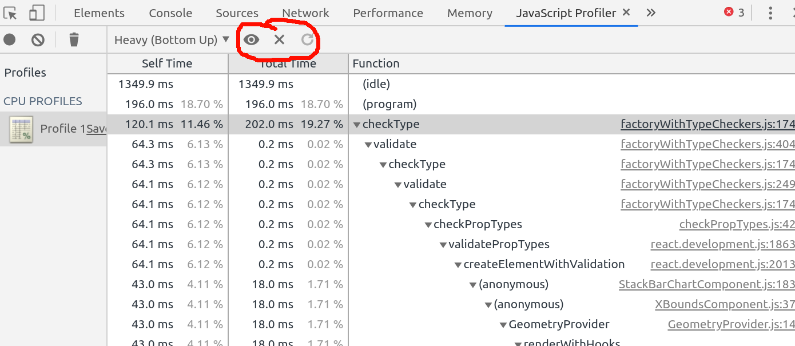  

# Rendering
Много интересных чекбоксов:  
- Paint flashing  
- FPS meter  
- Layout shift regions - Scrolling Performance Issues is indicating that there's a mousewheel
  event listener encompassing the entire viewport that may harm scroll performance  
- and others

# Perf Monitor
`Ctrl+Shift+P`Show performance monitor

`CPU usage` — what percentage of your CPU the site is using, цвета как в [Performance](#Performance)  
`JS heap size` — how much memory (in Megabytes) is being used by the app  
`DOM Nodes` — how many DOM nodes are in memory  
`JS event listeners` — how many JavaScript event listeners are registered  
`Documents` — number of live document resources like stylesheets and scripts  
`Frames` — the number of live frames on the page (iframes and workers)  
`Layouts / sec` — the rate at which the browser has to re-layout the DOM  
`Style recalcs / sec` — the rate at which the browser has to recalculate styles  

# Layers
`Ctrl+Shift+P`Show layers
Откуда берутся: element type (e.g. `canvas`, `video`), presence of certain CSS properties (e.g. 3D transforms), or interaction with other layer-generating elements  
https://www.chromium.org/developers/design-documents/gpu-accelerated-compositing-in-chrome  
Много слоев - хуже перф по памяти (и цпу во время compositing),  
но когда все на одном слое - хуже по цпу: приходится делать paint тяжелого слоя  

# React devtools
Полезная галочка в конфиге highlight updates - захайлайтятся те элементы, которые обновились в реакте   

### Components
Инспектим пропсы, хуки. Очень крутой раздел rendered by - список всех предков  
в настройках: hide components.  
type - можно прочитать в подсказках  
name - фильтр по имени  
hoc - High order component, девтул считает что любой компонент, который рендерит только один другой компонент - high order.  
location - где был отрендерен, вот по этому значению:  
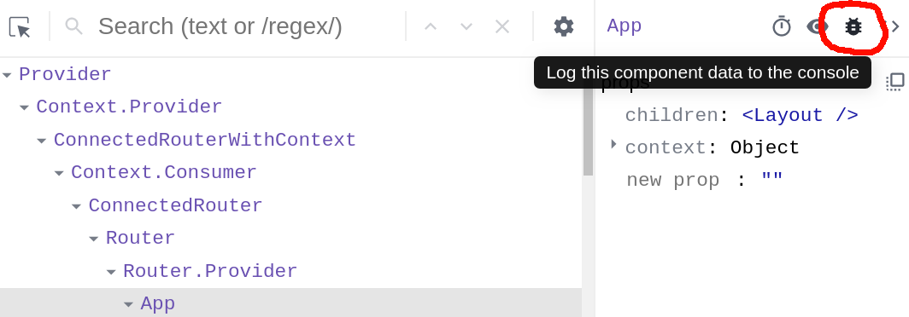  
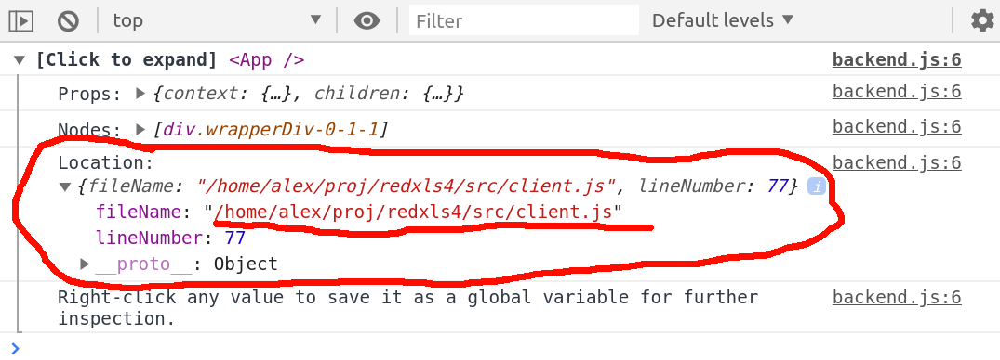  

### Profiler
Апдейт реакта проходит две фазы:  
1. Render - рендерит shadow DOM  
2. Commit - апдейтит настоящий DOM  

В маленьком графике наверху - сгруппировано по "коммитам"  
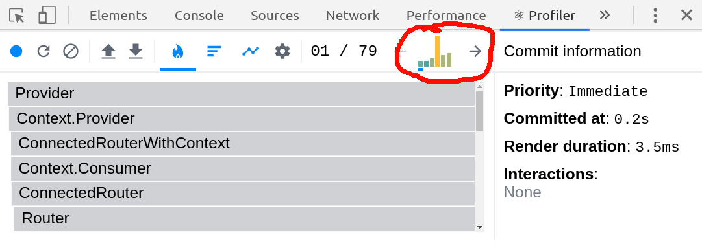  
FLAMEGRAPH - покажет как они исполнялись по времени  
Ширина - длительность последнего рендера (если в данном "кадре" компонент не рендерился - значит предыдущего)  
Цвет - как долго занял рендер  
желтый - долго  
зеленый - быстро  
серый - компонент не рендерился в данной фазе, его ширина показывает, как он рендерился в последний раз, когда был апдейтнут  
можно выделить компонент и походить по "коммитам", компонент останется выделен. удобно  
галочка в настройках - why did this render  
RANKED - отсортировано по длительности  

# Audits
`Ctrl+Shift+P`Show audits
nuff said  

# Search
`Ctrl+Shift+P`search  
Поиск по всем-всем исходникам на странице  

# Sensors
`Ctrl+Shift+P`sensors  
Имитация мобил: geolocation, orientation  

2019 Алексей Лебедев [t.me/axlebedev](t.me/axlebedev)  

